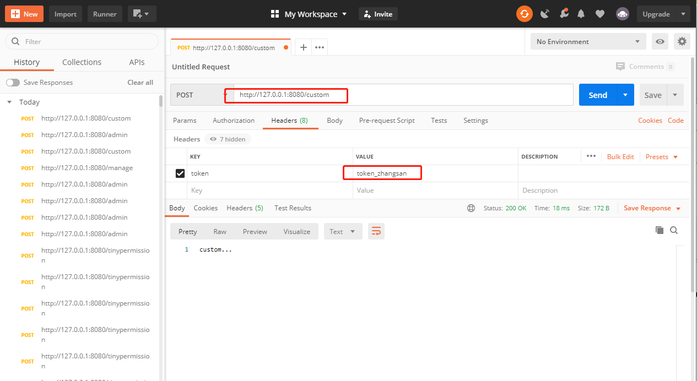
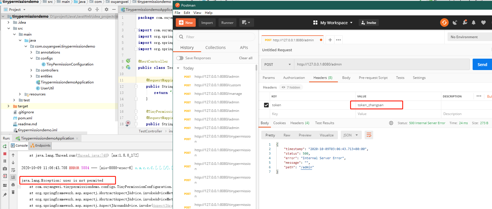
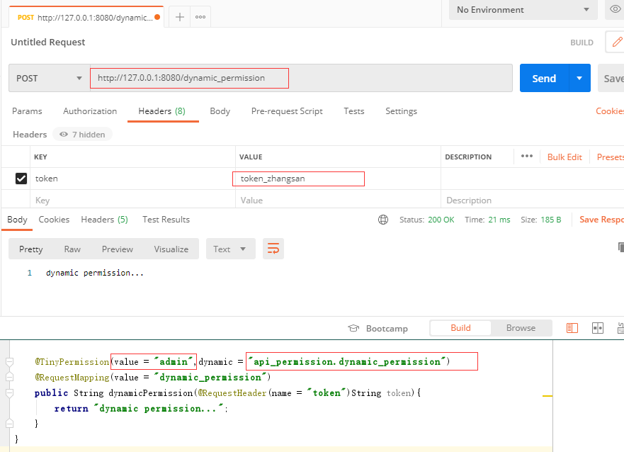

# tinypermissiondemo

**微权限demo，自定义了@TinyPermission注解，使用该注解即可达到权限过滤的目的。**
* 项目结构：tinypermission为TinyPermission的独立实现，demo为使用TinyPermission注解的演示demo和指南。

**Tips：tinypermission可以①单独打成jar包后使用；②同demo的方式，作为单独的module使用。**

* 示例代码
```java
@TinyPermission(value = "admin")
@RequestMapping(value = "/admin")
public String admin(@RequestHeader(name = "token")String token){
    return "admin...";
}

@TinyPermission(value = "admin,manage")
@RequestMapping(value = "/manage")
public String manage(@RequestHeader(name = "token")String token){
    return "manage...";
}

@TinyPermission(value = "admin,manage,custom")
@RequestMapping(value = "/custom")
public String custom(@RequestHeader(name = "token")String token){
    return "custom...";
}

@TinyPermission(value = "admin",dynamic = "api_permission.dynamic_permission")
@RequestMapping(value = "dynamic_permission")
public String dynamicPermission(@RequestHeader(name = "token")String token){
    return "dynamic permission...";
}
```
以上代码可达到的效果为：
http请求头附带token参数，TinyPermission根据该token从mysql/redis/jwt等用户载体中取出用户，判断该用户是否具有value（静态权限）和dynamic（动态权限）众多权限的其中一个，如果用户有权限，则正常执行该请求，否则抛出对应的异常，**详细的代码，可阅读TinyPermissionConfiguration获悉。**

**注意：此demo并没有直接从任何数据载体中取出用户和动态权限，而是以UserUtil和ApiPermissionsUtil来模拟该过程。**

* 有权限访问图



* 无权限访问图



* 动态权限图（以上2图说明，zhangsan有manage权限，无admin权限，此处dynamic权限中有manage，可看demo代码获悉）

